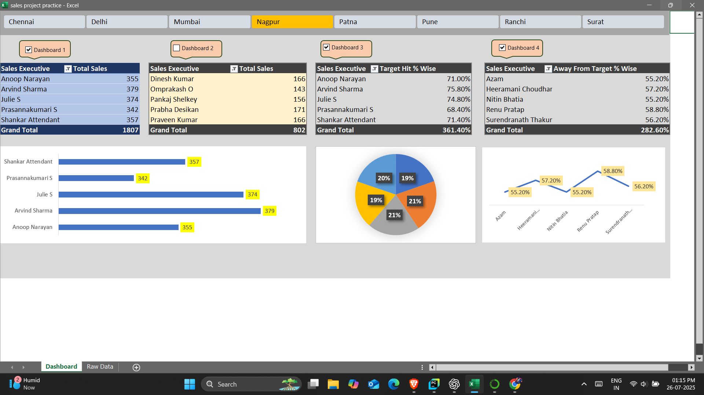

# excel-sales-project-practice
Excel dashboard project with pivot charts and macros
# 📊 Sales Project Practice (Excel)

This is a full Excel dashboard project analyzing sales performance. It includes pivot charts, slicers, and macros for automation.

## 🔧 Tools & Features Used
- Microsoft Excel
- Pivot Tables & Charts
- Slicers
- Conditional Formatting
- Macros (.xlsm)
- Power Query

## 📈 Dashboard Insights
- Monthly and quarterly sales trends
- Top regions and top products
- Sales vs Inventory
- Filterable dashboard with slicers

## 🖼️ Preview

## 📁 Download Project
👉 Click [here](sales%20project%20practice.xlsm) to download the Excel file.

## 🎯 Goal
This project was done to practice dashboard creation, data analysis, and reporting using Excel. Ideal for job-ready Excel skills.
